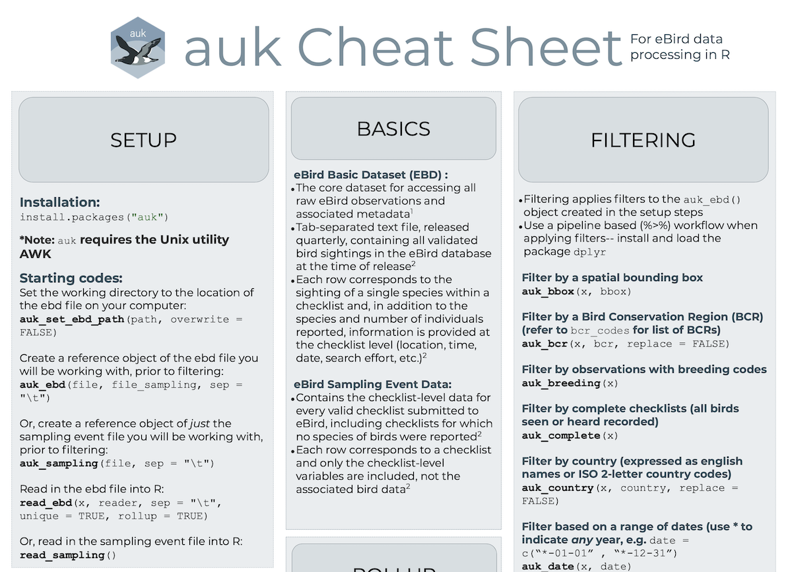

<!-- README.md is generated from README.Rmd. Please edit that file -->

# auk: eBird Data Extraction and Processing in R 

<!-- badges: start -->

<!-- badges: end -->

## Overview

[eBird](http://www.ebird.org) is an online tool for recording bird
observations. Since its inception, over 600 million records of bird
sightings (i.e. combinations of location, date, time, and bird species)
have been collected, making eBird one of the largest citizen science
projects in history and an extremely valuable resource for bird research
and conservation. The full eBird database is packaged as a text file and
available for download as the [eBird Basic Dataset
(EBD)](http://ebird.org/ebird/data/download). Due to the large size of
this dataset, it must be filtered to a smaller subset of desired
observations before reading into R. This filtering is most efficiently
done using AWK, a Unix utility and programming language for processing
column formatted text data. This package acts as a front end for AWK,
allowing users to filter eBird data before import into R.

For a comprehensive resource on using eBird data for modeling species
distributions, consult the free online book [Best Practices for Using
eBird
Data](https://cornelllabofornithology.github.io/ebird-best-practices/)
and the association paper *Analytical guidelines to increase the value
of community science data: An example using eBird data to estimate
species distributions* ([Johnston et
al. 2021](https://onlinelibrary.wiley.com/doi/10.1111/ddi.13271)).

## Installation

    # cran release
    install.packages("auk")

    # or install the development version from github
    # install.packages("remotes")
    remotes::install_github("CornellLabofOrnithology/auk")

`auk` requires the Unix utility AWK, which is available on most Linux
and Mac OS X machines. Windows users will first need to install
[Cygwin](https://www.cygwin.com) before using this package. Note that
**Cygwin must be installed in the default location**
(`C:/cygwin/bin/gawk.exe` or `C:/cygwin64/bin/gawk.exe`) in order for
`auk` to work.

## Vignette

Full details on using `auk` to produce both presence-only and
presence-absence data are outlined in the
[vignette](https://cornelllabofornithology.github.io/auk/articles/auk.html).

## Cheatsheet

An `auk` cheatsheet was developed by [Mickayla
Johnston](https://www.linkedin.com/in/mickayla-johnston/):

## `auk` and `rebird`

Those interested in eBird data may also want to consider
[`rebird`](https://github.com/ropensci/rebird), an R package that
provides an interface to the [eBird
APIs](https://confluence.cornell.edu/display/CLOISAPI/eBirdAPIs). The
functions in `rebird` are mostly limited to accessing recent
(i.e. within the last 30 days) observations, although `ebirdfreq()` does
provide historical frequency of observation data. In contrast, `auk`
gives access to the full set of ~ 500 million eBird observations. For
most ecological applications, users will require `auk`; however, for
some use cases, e.g. building tools for birders, `rebird` provides a
quick and easy way to access data.

## A note on versions

This package contains a current (as of the time of package release)
version of the [bird taxonomy used by
eBird](http://help.ebird.org/customer/portal/articles/1006825-the-ebird-taxonomy).
This taxonomy determines the species that can be reported in eBird and
therefore the species that users of `auk` can extract. eBird releases an
updated taxonomy once a year, typically in August, at which time `auk`
will be updated to include the current taxonomy. When using `auk`, users
should be careful to ensure that the version they’re using is in sync
with the eBird Basic Dataset they’re working with. This is most easily
accomplished by always using the must recent version of `auk` and the
most recent release of the dataset.

## Quick start

This package uses the command-line program AWK to extract subsets of the
eBird Basic Dataset for use in R. This is a multi-step process:

1.  Define a reference to the eBird data file.
2.  Define a set of spatial, temporal, or taxonomic filters. Each type
    of filter corresponds to a different function, e.g. `auk_species` to
    filter by species. At this stage the filters are only set up, no
    actual filtering is done until the next step.
3.  Filter the eBird data text file, producing a new text file with only
    the selected rows.
4.  Import this text file into R as a data frame.

Because the eBird dataset is so large, step 3 typically takes several
hours to run. Here’s a simple example that extract all Canada Jay
records from within Canada.

    library(auk)
    # path to the ebird data file, here a sample included in the package
    # get the path to the example data included in the package
    # in practice, provide path to ebd, e.g. f_in <- "data/ebd_relFeb-2018.txt
    f_in <- system.file("extdata/ebd-sample.txt", package = "auk")
    # output text file
    f_out <- "ebd_filtered_grja.txt"
    ebird_data <- f_in %>% 
      # 1. reference file
      auk_ebd() %>% 
      # 2. define filters
      auk_species(species = "Canada Jay") %>% 
      auk_country(country = "Canada") %>% 
      # 3. run filtering
      auk_filter(file = f_out) %>% 
      # 4. read text file into r data frame
      read_ebd()

For those not familiar with the pipe operator (`%>%`), the above code
could be rewritten:

    f_in <- system.file("extdata/ebd-sample.txt", package = "auk")
    f_out <- "ebd_filtered_grja.txt"
    ebd <- auk_ebd(f_in)
    ebd_filters <- auk_species(ebd, species = "Canada Jay")
    ebd_filters <- auk_country(ebd_filters, country = "Canada")
    ebd_filtered <- auk_filter(ebd_filters, file = f_out)
    ebd_df <- read_ebd(ebd_filtered)

## Usage

### Filtering

`auk` uses a [pipeline-based workflow](http://r4ds.had.co.nz/pipes.html)
for defining filters, which can then be compiled into an AWK script.
Users should start by defining a reference to the dataset file with
`auk_ebd()`. Then any of the following filters can be applied:

-   `auk_species()`: filter by species using common or scientific names.
-   `auk_country()`: filter by country using the standard English names
    or [ISO 2-letter country
    codes](https://en.wikipedia.org/wiki/ISO_3166-1_alpha-2).
-   `auk_state()`: filter by state using eBird state codes, see
    `?ebird_states`.
-   `auk_bcr()`: filter by [Bird Conservation Region
    (BCR)](http://nabci-us.org/resources/bird-conservation-regions/)
    using BCR codes, see `?bcr_codes`.
-   `auk_bbox()`: filter by spatial bounding box, i.e. a range of
    latitudes and longitudes in decimal degrees.
-   `auk_date()`: filter to checklists from a range of dates. To extract
    observations from a range of dates, regardless of year, use the
    wildcard “`*`” in place of the year,
    e.g. `date = c("*-05-01", "*-06-30")` for observations from May and
    June of any year.
-   `auk_last_edited()`: filter to checklists from a range of last
    edited dates, useful for extracting just new or recently edited
    data.
-   `auk_protocol()`: filter to checklists that following a specific
    search protocol, either stationary, traveling, or casual.
-   `auk_project()`: filter to checklists collected as part of a
    specific project (e.g. a breeding bird survey).
-   `auk_time()`: filter to checklists started during a range of
    times-of-day.
-   `auk_duration()`: filter to checklists with observation durations
    within a given range.
-   `auk_distance()`: filter to checklists with distances travelled
    within a given range.
-   `auk_breeding()`: only retain observations that have an associate
    breeding bird atlas code.
-   `auk_complete()`: only retain checklists in which the observer has
    specified that they recorded all species seen or heard. It is
    necessary to retain only complete records for the creation of
    presence-absence data, because the “absence”” information is
    inferred by the lack of reporting of a species on checklists.

Note that all of the functions listed above only modify the `auk_ebd`
object, in order to define the filters. Once the filters have been
defined, the filtering is actually conducted using `auk_filter()`.

    # sample data
    f <- system.file("extdata/ebd-sample.txt", package = "auk")
    # define an EBD reference and a set of filters
    ebd <- auk_ebd(f) %>% 
      # species: common and scientific names can be mixed
      auk_species(species = c("Canada Jay", "Cyanocitta cristata")) %>%
      # country: codes and names can be mixed; case insensitive
      auk_country(country = c("US", "Canada", "mexico")) %>%
      # bbox: long and lat in decimal degrees
      # formatted as `c(lng_min, lat_min, lng_max, lat_max)`
      auk_bbox(bbox = c(-100, 37, -80, 52)) %>%
      # date: use standard ISO date format `"YYYY-MM-DD"`
      auk_date(date = c("2012-01-01", "2012-12-31")) %>%
      # time: 24h format
      auk_time(start_time = c("06:00", "09:00")) %>%
      # duration: length in minutes of checklists
      auk_duration(duration = c(0, 60)) %>%
      # complete: all species seen or heard are recorded
      auk_complete()
    ebd
    #> Input 
    #>   EBD: /private/var/folders/wf/y1p0nztd2ps95ppplsl5bjjr0000gs/T/RtmpFBhSHB/temp_libpath9b323c8f60e8/auk/extdata/ebd-sample.txt 
    #> 
    #> Output 
    #>   Filters not executed
    #> 
    #> Filters 
    #>   Species: Cyanocitta cristata, Perisoreus canadensis
    #>   Countries: CA, MX, US
    #>   States: all
    #>   Counties: all
    #>   BCRs: all
    #>   Bounding box: Lon -100 - -80; Lat 37 - 52
    #>   Years: all
    #>   Date: 2012-01-01 - 2012-12-31
    #>   Start time: 06:00-09:00
    #>   Last edited date: all
    #>   Protocol: all
    #>   Project code: all
    #>   Duration: 0-60 minutes
    #>   Distance travelled: all
    #>   Records with breeding codes only: no
    #>   Exotic Codes: all
    #>   Complete checklists only: yes

In all cases, extensive checks are performed to ensure filters are
valid. For example, species are checked against the official [eBird
taxonomy](http://help.ebird.org/customer/portal/articles/1006825-the-ebird-taxonomy)
and countries are checked using the
[`countrycode`](https://github.com/vincentarelbundock/countrycode)
package.

Each of the functions described in the *Defining filters* section only
defines a filter. Once all of the required filters have been set,
`auk_filter()` should be used to compile them into an AWK script and
execute it to produce an output file. So, as an example of bringing all
of these steps together, the following commands will extract all Canada
Jay and Blue Jay records from Canada and save the results to a
tab-separated text file for subsequent use:

    output_file <- "ebd_filtered_blja-grja.txt"
    ebd_filtered <- system.file("extdata/ebd-sample.txt", package = "auk") %>% 
      auk_ebd() %>% 
      auk_species(species = c("Canada Jay", "Cyanocitta cristata")) %>% 
      auk_country(country = "Canada") %>% 
      auk_filter(file = output_file)

**Filtering the full dataset typically takes at least a couple hours**,
so set it running then go grab lunch!

### Reading

eBird Basic Dataset files can be read with `read_ebd()`:

    system.file("extdata/ebd-sample.txt", package = "auk") %>% 
      read_ebd() %>% 
      str()
    #> tibble [398 × 48] (S3: tbl_df/tbl/data.frame)
    #>  $ checklist_id             : chr [1:398] "G1131664" "G1131665" "G1158137" "G1158138" ...
    #>  $ global_unique_identifier : chr [1:398] "URN:CornellLabOfOrnithology:EBIRD:OBS294400626" "URN:CornellLabOfOrnithology:EBIRD:OBS130231497" "URN:CornellLabOfOrnithology:EBIRD:OBS299129479" "URN:CornellLabOfOrnithology:EBIRD:OBS299130486" ...
    #>  $ last_edited_date         : chr [1:398] "2021-03-29 21:21:52.583259" "2020-02-01 20:30:42" "2018-08-03 18:05:21" "2015-02-23 20:14:13" ...
    #>  $ taxonomic_order          : int [1:398] 20724 20724 20674 20674 20724 20724 20786 20674 20724 20724 ...
    #>  $ category                 : chr [1:398] "species" "species" "species" "species" ...
    #>  $ taxon_concept_id         : chr [1:398] "avibase-361B447A" "avibase-361B447A" "avibase-69A6E32F" "avibase-69A6E32F" ...
    #>  $ common_name              : chr [1:398] "Green Jay" "Green Jay" "Canada Jay" "Canada Jay" ...
    #>  $ scientific_name          : chr [1:398] "Cyanocorax yncas" "Cyanocorax yncas" "Perisoreus canadensis" "Perisoreus canadensis" ...
    #>  $ exotic_code              : chr [1:398] NA NA NA NA ...
    #>  $ observation_count        : chr [1:398] "2" "6" "1" "1" ...
    #>  $ breeding_code            : chr [1:398] NA NA NA NA ...
    #>  $ breeding_category        : chr [1:398] NA NA NA NA ...
    #>  $ behavior_code            : chr [1:398] NA NA NA NA ...
    #>  $ age_sex                  : chr [1:398] NA NA NA NA ...
    #>  $ country                  : chr [1:398] "United States" "United States" "Canada" "Canada" ...
    #>  $ country_code             : chr [1:398] "US" "US" "CA" "CA" ...
    #>  $ state                    : chr [1:398] "Texas" "Texas" "British Columbia" "British Columbia" ...
    #>  $ state_code               : chr [1:398] "US-TX" "US-TX" "CA-BC" "CA-BC" ...
    #>  $ county                   : chr [1:398] "Zapata" "Starr" "Northern Rockies" "Northern Rockies" ...
    #>  $ county_code              : chr [1:398] "US-TX-505" "US-TX-427" "CA-BC-NR" "CA-BC-NR" ...
    #>  $ iba_code                 : chr [1:398] NA NA NA NA ...
    #>  $ bcr_code                 : int [1:398] 36 36 6 6 48 36 13 10 36 48 ...
    #>  $ usfws_code               : chr [1:398] NA NA NA NA ...
    #>  $ atlas_block              : chr [1:398] NA NA NA NA ...
    #>  $ locality                 : chr [1:398] "Zapata Library / City Park (LTC 085)" "Falcon State Park (LTC 084)" "Parker Lake" "Parker Lake" ...
    #>  $ locality_id              : chr [1:398] "L846015" "L128962" "L343808" "L343808" ...
    #>  $ locality_type            : chr [1:398] "H" "H" "H" "H" ...
    #>  $ latitude                 : num [1:398] 26.9 26.6 58.8 58.8 25.5 ...
    #>  $ longitude                : num [1:398] -99.3 -99.1 -122.9 -122.9 -100.3 ...
    #>  $ observation_date         : Date[1:398], format: "2011-11-14" "2011-11-14" ...
    #>  $ time_observations_started: chr [1:398] "06:45:00" "08:15:00" "10:30:00" "07:00:00" ...
    #>  $ observer_id              : chr [1:398] "obsr554038" "obsr146271" "obsr12384" "obsr12384" ...
    #>  $ sampling_event_identifier: chr [1:398] "S21633922" "S9118288" "S22036612" "S22036670" ...
    #>  $ protocol_type            : chr [1:398] "Traveling" "Traveling" "Stationary" "Stationary" ...
    #>  $ protocol_code            : chr [1:398] "P22" "P22" "P21" "P21" ...
    #>  $ project_code             : chr [1:398] "EBIRD" "EBIRD" "EBIRD" "EBIRD" ...
    #>  $ duration_minutes         : int [1:398] 30 60 60 90 90 90 90 35 60 60 ...
    #>  $ effort_distance_km       : num [1:398] 1.61 3.22 NA NA 1 ...
    #>  $ effort_area_ha           : num [1:398] NA NA NA NA NA NA NA NA NA NA ...
    #>  $ number_observers         : int [1:398] 2 2 13 13 7 2 2 5 4 5 ...
    #>  $ all_species_reported     : logi [1:398] TRUE TRUE TRUE TRUE TRUE TRUE ...
    #>  $ group_identifier         : chr [1:398] "G1131664" "G1131665" "G1158137" "G1158138" ...
    #>  $ has_media                : logi [1:398] FALSE FALSE FALSE FALSE FALSE FALSE ...
    #>  $ approved                 : logi [1:398] TRUE TRUE TRUE TRUE TRUE TRUE ...
    #>  $ reviewed                 : logi [1:398] FALSE FALSE FALSE FALSE FALSE FALSE ...
    #>  $ reason                   : chr [1:398] NA NA NA NA ...
    #>  $ trip_comments            : chr [1:398] NA NA "BCFO extension trip" "BCFO extension trip" ...
    #>  $ species_comments         : chr [1:398] NA NA NA NA ...
    #>  - attr(*, "rollup")= logi TRUE

## Presence-absence data

For many applications, presence-only data are sufficient; however, for
modeling and analysis, presence-absence data are required. `auk`
includes functionality to produce presence-absence data from eBird
checklists. For full details, consult the vignette: `vignette("auk")`.

## Code of Conduct

Please note that this project is released with a [Contributor Code of
Conduct](CONDUCT.md). By participating in this project you agree to
abide by its terms.

## Acknowledgements

This package is based on AWK scripts provided as part of the eBird Data
Workshop given by Wesley Hochachka, Daniel Fink, Tom Auer, and Frank La
Sorte at the 2016 NAOC on August 15, 2016.

`auk` benefited significantly from the [rOpenSci](https://ropensci.org/)
review process, including helpful suggestions from [Auriel
Fournier](https://github.com/aurielfournier) and [Edmund
Hart](https://github.com/emhart).

## References

    eBird Basic Dataset. Version: ebd_relFeb-2018. Cornell Lab of Ornithology, Ithaca, New York. May 2013.

